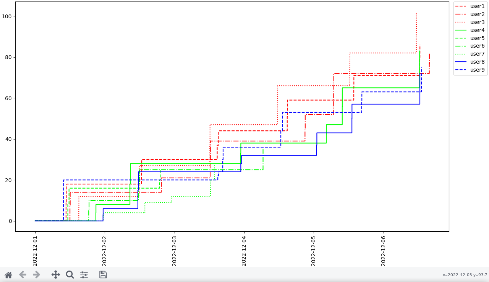

# What this is

A simple Python3 program reading [Advent of Code](https://adventofcode.com/) private leaderboard data in JSON format, calculating changes in points based on provided timestamps, and ultimately drawing a graph showing how each leaderboard member has been performing compared to the other ones.

# Why this exists

Advent of Code lets you get a JSON file for each of your private leaderboards. I thought it would be neat to do something with it, like see how far behind I am compared to my friends

# How to use this

1. Get the JSON file for a [private leaderboard](https://adventofcode.com/2022/leaderboard/private) (this link will take you to the 2022 event) and save it in the same directory as the *main.py* file. The program will look for a file named *data.json*, but you can change it at the top of the script.
2. Run `python3 main.py`. The program will do some stuff (which might include some inefficient operations) and eventually, you should see a *matplotlib* window pop out, showing how each member's points have changed (assuming the member count was always constant). You might need to install *matplotlib* first, if you don't have it.

# More info

This program has been tested with **Python 3.10.8**.
It contains almost no comments, no documentation, no error handling besides checking if the JSON file has a *members* key. Feel free to suggest improvements or ask me to update it with any of those things and I'll do my best.